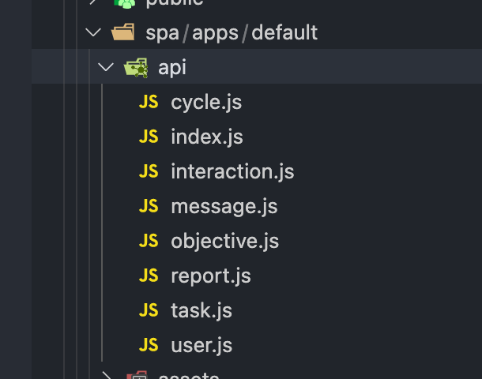
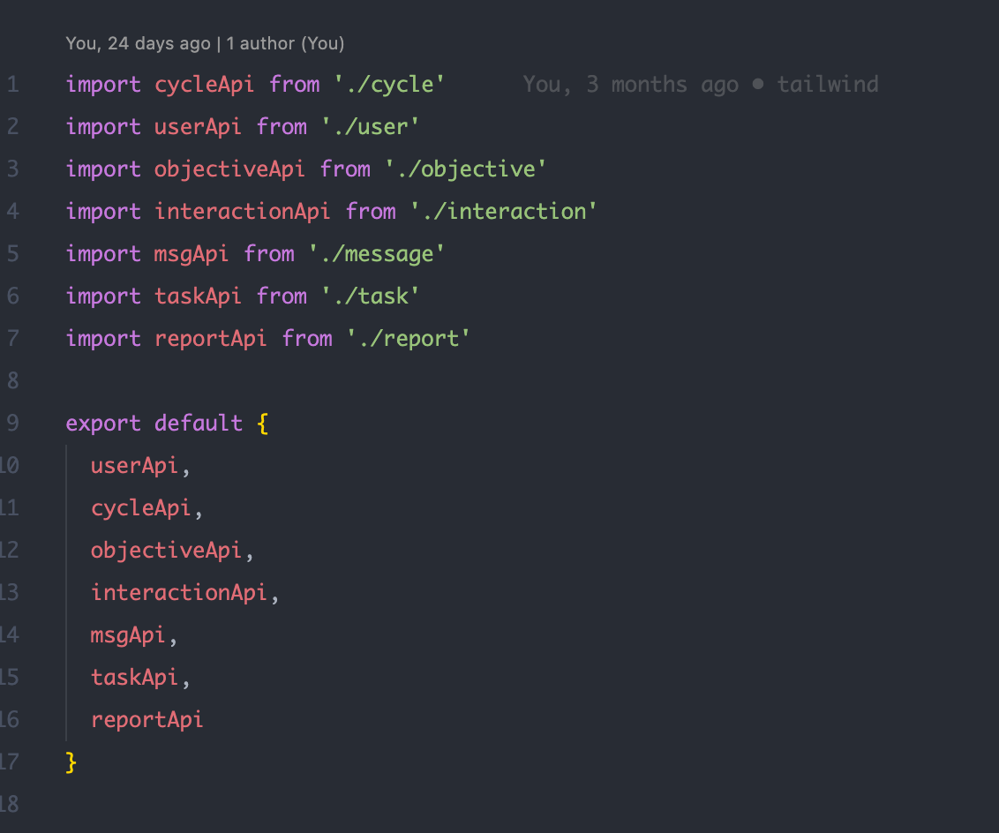
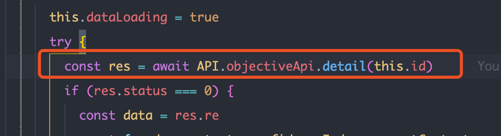

### api相关使用规范
- api命名遵循:[RESTful Api 规范](https://choerodon.io/zh/docs/contributor-guide/development/conventions/restful/)
- api文件命名方式：
  - 按照功能逻辑划分，
  - 要求命名语意化，
  - 使用PascalCase命名
  

- api文件导出规则：
  - 从index.ts统一导出
  

- api 获取：
  - 获取方式`api.xxx.xxx`
  

